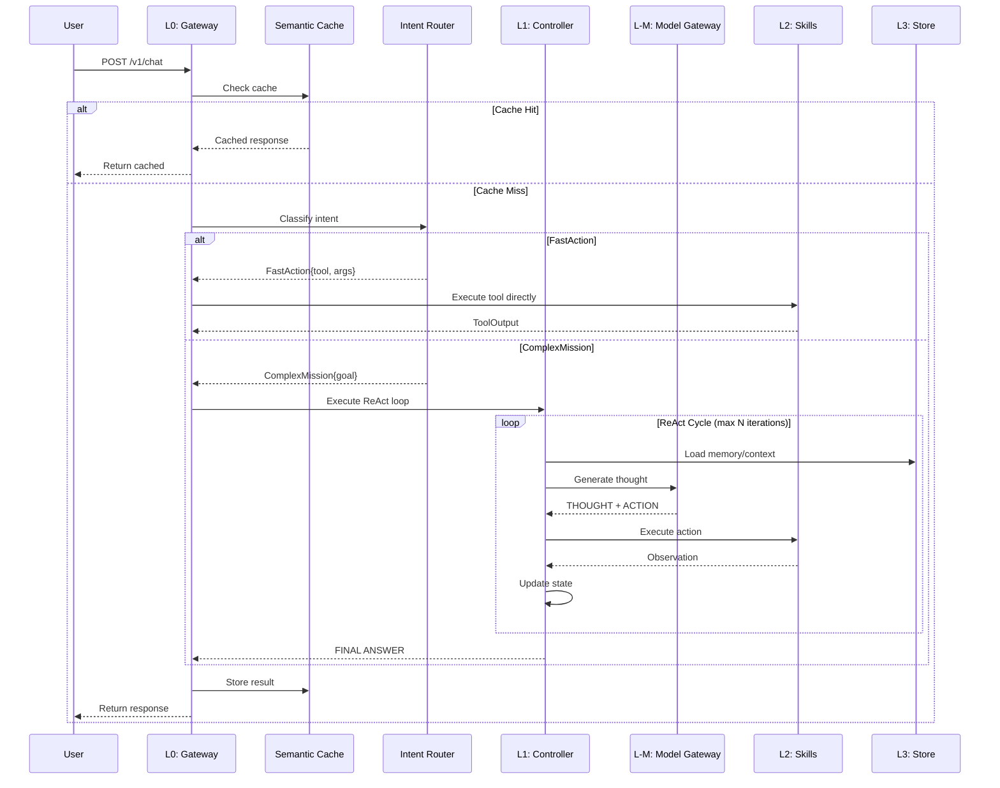

# Multiagent: Advanced Multi-Agent AI System

[](LICENSE)
[](https://www.rust-lang.org)
[](https://github.com/wqswing/MultiAgent-AI/actions)
[](Dockerfile)
[](CONTRIBUTING.md)
[](https://github.com/wqswing/MultiAgent-AI/releases/tag/v1.1.0)

Multiagent is a production-grade, layered AI agent framework built in Rust. It is designed for high-performance orchestration of LLM capabilities, supporting multi-modal inputs, autonomous reasoning (ReAct), complex workflow automation (DAG/SOP), and robust enterprise features like semantic caching, vector memory, and circuit breakers.

## ✨ What's New in v1.2 (Enterprise Evolution)

- **Unified Configuration**: Centralized `AppConfig` with TOML/Env layering and validated defaults across all crates.
- **Tamper-Evident Audit**: Cryptographically chained audit logs with SHA-256 hashing to ensure data integrity.
- **Queryable Audit Store**: High-performance SQLite backend for audit trails with structured search and filtering.
- **Deployment Convergence**: Production-ready Helm charts and Docker Compose profiles for seamless multi-environment rollout.
- **Security Hardening**: Standardized API namespacing (`/v1/admin`) and enhanced mTLS support for inter-service communication.

## ✨ What's New in v1.1 (Sovereign & Resilient)

- **System Doctor**: Automated self-diagnosis for API connectivity, storage availability, and security health.
- **Sovereign Sandbox**: Docker-based tool execution environment for safe code execution.
- **Airlock Networking**: Fine-grained network governance for agent tools.
- **Axum 0.7 Migration**: Fully upgraded web layer with enhanced type safety and performance.
- **Privacy & Retention**: Automated background pruning of old sessions and one-click data erasure.

## ✨ What's New in v1.0 (Stateless Architecture)

- **Stateless & Scalable**: fully decoupled state management using Redis.
    - **Session Persistence**: Long-running agent tasks (`ReActLoop`) persist state after every step, enabling seamless resumption across pods.
    - **Distributed Rate Limiting**: Global sliding window rate limiter backed by Redis Lua scripts.
- **Enhanced Admin Dashboard**:
    - **Provider Management**: Configure LLM providers (OpenAI, Anthropic, Local) dynamically via UI.
    - **MCP Registry**: Inspect and manage Model Context Protocol servers directly from the dashboard.
    - **Persistence Config**: Hot-swap storage backends (S3/MinIO) without restarts.
- **Security Hardening**:
    - **Encryption at Rest**: Provider API keys are encrypted using AES-256-GCM before storage.
    - **RBAC Enforcement**: Strict role-based access control for all admin endpoints.

## 🚀 Key Capabilities

### 🧠 Intelligence Layer
- **Autonomous Agents**: Uses the ReAct (Reason+Act) pattern to solve complex, multi-step problems
- **Workflow Orchestration**: Supports parallel execution of tasks via DAGs and SOPs defined in YAML
- **Adaptive Model Selection**: Dynamically routes requests to the best LLM based on complexity and cost
- **Long-Term Memory**: RAG-enabled memory with Qdrant vector database integration

### ⚡ Performance & Scalability
- **Semantic Caching**: Vector-embedding based caching to serve repeated queries instantly
- **Tiered Storage**: Hybrid storage using In-Memory (fast), Redis (state), and S3 (artifacts)
- **Circuit Breaker**: Automatic failure detection and isolation for LLM providers

### �️ Governance & Security
- **Guardrails**: Integrated PII detection, prompt injection mitigation, and custom policy enforcement
- **Tamper-Evident Auditing**: SHA-256 hash chaining for all administrative actions with SQLite persistence
- **Budget Control**: Real-time token tracking and usage limits per user/workspace
- **Sovereign Sandbox**: Secure, isolated environment for executing code tools (Docker-backed)
- **Airlock**: Multi-layer network governance for tool-triggered outbound requests
- **Secrets Management**: AES-256-GCM encrypted persistence for LLM provider keys

## 🏗️ Architecture

Multiagent follows a strict 6-layer architecture for separation of concerns and scalability.

### Layer Architecture
```
┌─────────────────────────────────────────────────────────────┐
│                     User / Client                            │
└──────────────────────────┬──────────────────────────────────┘
                           │
┌──────────────────────────▼──────────────────────────────────┐
│  L0: Gateway Layer                                           │
│  ┌─────────────┐ ┌─────────────┐ ┌────────────────┐         │
│  │ Axum Server │ │Intent Router│ │ Semantic Cache │         │
│  └─────────────┘ └─────────────┘ └────────────────┘         │
└──────────────────────────┬──────────────────────────────────┘
                           │
┌──────────────────────────▼──────────────────────────────────┐
│  L1: Controller Layer                                        │
│  ┌─────────────┐ ┌─────────────┐ ┌────────────────┐         │
│  │ReAct Engine │ │  Capabilties│ │ Parser/Executor│         │
│  └─────────────┘ └─────────────┘ └────────────────┘         │
└──────────────────────────┬──────────────────────────────────┘
                           │
┌──────────────────────────▼──────────────────────────────────┐
│  L2: Skills Layer                                            │
│  ┌─────────────┐ ┌─────────────┐ ┌────────────────┐         │
│  │Tool Registry│ │ MCP Adapter │ │ Builtin Tools  │         │
│  └─────────────┘ └─────────────┘ └────────────────┘         │
└──────────────────────────┬──────────────────────────────────┘
                           │
┌──────────────────────────▼──────────────────────────────────┐
│  L3: Store Layer                                             │
│  ┌─────────────┐ ┌─────────────┐ ┌────────────────┐         │
│  │  In-Memory  │ │ Redis/S3    │ │ Qdrant Vector  │         │
│  └─────────────┘ └─────────────┘ └────────────────┘         │
└──────────────────────────┬──────────────────────────────────┘
                           │
┌──────────────────────────▼──────────────────────────────────┐
│  L4: Governance & Audit Layer                                │
│  ┌─────────────┐ ┌─────────────┐ ┌────────────────┐         │
│  │ Guardrails  │ │ Audit Store │ │ Metrics/Trace  │         │
│  │ (PII/Injection)│ (Hash Chained)│ (Prometheus)   │         │
│  └─────────────┘ └─────────────┘ └────────────────┘         │
└──────────────────────────┬──────────────────────────────────┘
                           │
┌──────────────────────────▼──────────────────────────────────┐
│  L-M: Model Gateway                                          │
│  ┌─────────────┐ ┌─────────────┐ ┌────────────────┐         │
│  │   Selector  │ │Circuit Break│ │ OpenAI/Claude  │         │
│  └─────────────┘ └─────────────┘ └────────────────┘         │
└─────────────────────────────────────────────────────────────┘
```

### Request Flow




## 📂 Project Structure

```
crates/
├── core/           # Shared traits & types
│   ├── traits/     # Modular trait definitions by layer
│   ├── types/      # AgentResult, Session, ToolOutput
│   └── mocks.rs    # Test mocks for all components
├── gateway/        # Axum server, Semantic Cache, Router
├── controller/     # ReAct loop, Parser, Executor
├── skills/         # Tool Registry, MCP Adapter
├── store/          # Redis, S3, Qdrant implementations
├── governance/     # Guardrails, Budget, Metrics
├── admin/          # Management API & Dashboard
└── model_gateway/  # LLM Provider integration
```

## 🛠️ Getting Started

### Prerequisites
- **Rust**: 1.75+
- **Docker**: For dependencies (Redis, Qdrant, Jaeger)
- **API Keys**: OpenAI or Anthropic

### Environment Setup

```bash
# LLM Providers
export OPENAI_API_KEY=sk-...
export ANTHROPIC_API_KEY=sk-...

# Persistence (Optional)
export REDIS_URL=redis://localhost:6379
export QDRANT_URL=http://localhost:6334

# Observability
export OTEL_EXPORTER_OTLP_ENDPOINT=http://localhost:4317

### Kubernetes (Production)
```bash
# Deploy using Helm
helm install multi-agent ./charts/multi-agent -f values.yaml
```
```

### Running Locally

```bash
# Start infrastructure
docker-compose up -d

# Run the agent
cargo run

# Run tests
cargo test --workspace
```

The server listens on `http://0.0.0.0:3000`.

## 📖 Usage Examples

### Chat (ReAct Agent)
```bash
curl -X POST http://localhost:3000/v1/chat \
  -H "Content-Type: application/json" \
  -d '{"message": "Analyze this dataset and create a summary report."}'
```

### Fast Intent (Direct Tool)
```bash
curl -X POST http://localhost:3000/v1/intent \
  -H "Content-Type: application/json" \
  -d '{"message": "Calculate 123 * 456"}'
```

### Health & Metrics
```bash
curl http://localhost:3000/health
curl http://localhost:3000/metrics

### System Doctor (Self-Diagnosis)
```bash
curl -X POST http://localhost:3000/v1/admin/doctor \
  -H "Authorization: Bearer <admin_token>"
```

### Query Audit Logs
```bash
curl "http://localhost:3000/v1/admin/audit?action=DELETE_PROVIDER" \
  -H "Authorization: Bearer <admin_token>"
```
```

## 🧪 Testing

Multiagent includes comprehensive testing infrastructure:

```rust
use multi_agent_core::mocks::{MockLlm, MockToolRegistry, MockMemoryStore};

// Create deterministic LLM for testing
let llm = MockLlm::new(vec![
    "THOUGHT: Analyzing...".to_string(),
    "FINAL ANSWER: Done".to_string(),
]);

// Create recording tools
let tool = RecordingTool::new("search", "Search the web", "Results...");
```

## 📄 License

AGPLv3 License - See [LICENSE](LICENSE) for details.

Copyright (c) 2024-2026 Multiagent Contributors
