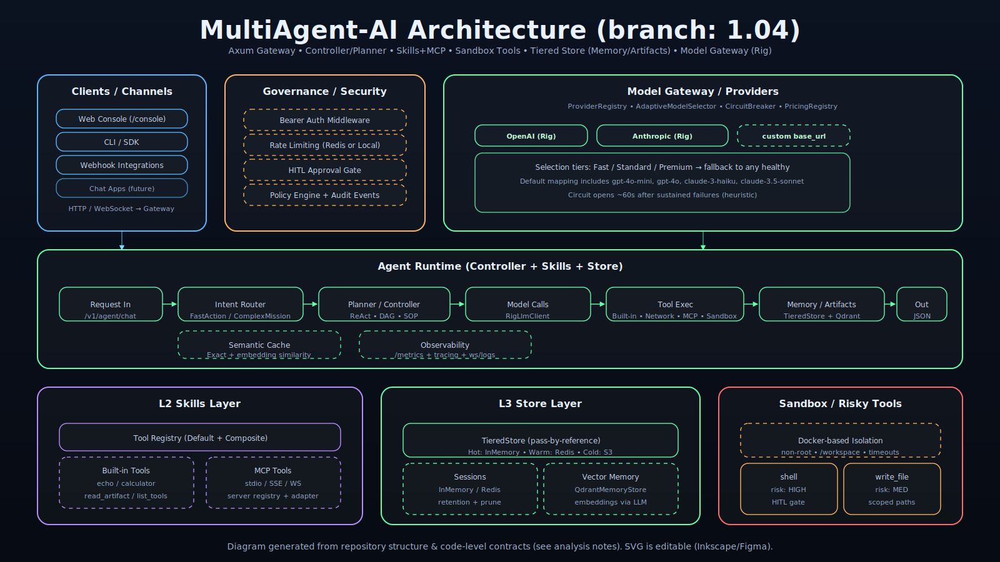

# Multiagent: Advanced Multi-Agent AI System

[](LICENSE)
[](https://www.rust-lang.org)
[](https://github.com/wqswing/MultiAgent-AI/actions)
[](Dockerfile)
[](CONTRIBUTING.md)
[](https://github.com/wqswing/MultiAgent-AI/releases/tag/v0.9.0)

Multiagent is a production-grade, layered AI agent framework built in Rust. It is designed for high-performance orchestration of LLM capabilities, supporting multi-modal inputs, autonomous reasoning (ReAct), complex workflow automation (DAG/SOP), and robust enterprise features like semantic caching, vector memory, and circuit breakers.

## 🚀 Key Capabilities

### 🧠 Intelligence Layer
- **Autonomous Agents**: Uses the ReAct (Reason+Act) pattern to solve complex, multi-step problems.
- **Workflow Orchestration**: Supports parallel execution of tasks via DAGs and SOPs defined in YAML.
- **Adaptive Model Selection**: Dynamically routes requests to the best LLM based on complexity and cost.
- **Long-Term Memory**: RAG-enabled memory with Qdrant vector database integration.
- **Model Context Protocol (MCP)**: Full support for connecting and managing external tool servers.

### ⚡ Performance & Scalability
- **Stateless & Scalable**: Fully decoupled state management using Redis for seamless horizontally scaling.
- **Session Persistence**: Long-running agent tasks persist state after every step, enabling resumption across pods.
- **Semantic Caching**: Vector-embedding based caching to serve repeated queries instantly.
- **Tiered Storage**: Hybrid storage using In-Memory (fast), Redis (state), and S3/MinIO (artifacts).
- **Circuit Breaker**: Automatic failure detection and isolation for LLM providers.

### 🛡️ Governance & Security
- **Guardrails**: Integrated PII detection, prompt injection mitigation, and custom policy enforcement.
- **Tamper-Evident Auditing**: SHA-256 hash chaining for all administrative actions with SQLite persistence.
- **Airlock Networking**: Fine-grained network governance and domain allowlisting for agent tools.
- **Sovereign Sandbox**: Secure, isolated Docker environment for executing untrusted tool code.
- **Secrets Management**: AES-256-GCM encrypted persistence for provider API keys.
- **RBAC Enforcement**: Strict role-based access control for all management endpoints.

### 📊 Management & Observability
- **Admin Dashboard**: Web-based console for managing providers, MCP servers, and session state.
- **System Doctor**: Automated self-diagnosis for connectivity, storage, and security health.
- **Distributed Rate Limiting**: Global sliding window rate limiter backed by Redis.
- **Privacy & Retention**: Automated background pruning and one-click user data erasure (GDPR ready).

### 🏗️ Deployment & Infrastructure
- **Unified Configuration**: Centralized `AppConfig` with TOML/Env layering and validated defaults.
- **Kubernetes Ready**: Production-grade Helm charts with resource limits and ingress configuration.
- **Docker First**: Composable `docker-compose.yml` with profiles for gateway, redis, and minio.

## 🏗️ Architecture

Multiagent follows a strict 6-layer architecture for separation of concerns and scalability.

### Layer Architecture



## 📂 Project Structure

```
crates/
├── core/           # Shared traits & types
│   ├── traits/     # Modular trait definitions by layer
│   ├── types/      # AgentResult, Session, ToolOutput
│   └── mocks.rs    # Test mocks for all components
├── gateway/        # Axum server, Semantic Cache, Router
├── controller/     # ReAct loop, Parser, Executor
├── skills/         # Tool Registry, MCP Adapter
├── store/          # Redis, S3, Qdrant implementations
├── governance/     # Guardrails, Budget, Metrics
├── admin/          # Management API & Dashboard
└── model_gateway/  # LLM Provider integration
```

## 🛠️ Getting Started

### Prerequisites
- **Rust**: 1.75+
- **Docker**: For dependencies (Redis, Qdrant, Jaeger)
- **API Keys**: OpenAI or Anthropic

### Environment Setup

```bash
# LLM Providers
export OPENAI_API_KEY=sk-...
export ANTHROPIC_API_KEY=sk-...

# Persistence (Optional)
export REDIS_URL=redis://localhost:6379
export QDRANT_URL=http://localhost:6334

# Observability
export OTEL_EXPORTER_OTLP_ENDPOINT=http://localhost:4317

### Kubernetes (Production)
```bash
# Deploy using Helm
helm install multi-agent ./charts/multi-agent -f values.yaml
```
```

### Running Locally

```bash
# Start infrastructure
docker-compose up -d

# Run the agent
cargo run

# Run tests
cargo test --workspace
```

The server listens on `http://0.0.0.0:3000`.

## 📖 Usage Examples

### Chat (ReAct Agent)
```bash
curl -X POST http://localhost:3000/v1/chat \
  -H "Content-Type: application/json" \
  -d '{"message": "Analyze this dataset and create a summary report."}'
```

### Fast Intent (Direct Tool)
```bash
curl -X POST http://localhost:3000/v1/intent \
  -H "Content-Type: application/json" \
  -d '{"message": "Calculate 123 * 456"}'
```

### Health & Metrics
```bash
curl http://localhost:3000/health
curl http://localhost:3000/metrics

### System Doctor (Self-Diagnosis)
```bash
curl -X POST http://localhost:3000/v1/admin/doctor \
  -H "Authorization: Bearer <admin_token>"
```

### Query Audit Logs
```bash
curl "http://localhost:3000/v1/admin/audit?action=DELETE_PROVIDER" \
  -H "Authorization: Bearer <admin_token>"
```
```

## 🧪 Testing

Multiagent includes comprehensive testing infrastructure:

```rust
use multi_agent_core::mocks::{MockLlm, MockToolRegistry, MockMemoryStore};

// Create deterministic LLM for testing
let llm = MockLlm::new(vec![
    "THOUGHT: Analyzing...".to_string(),
    "FINAL ANSWER: Done".to_string(),
]);

// Create recording tools
let tool = RecordingTool::new("search", "Search the web", "Results...");
```

## 📄 License

AGPLv3 License - See [LICENSE](LICENSE) for details.

Copyright (c) 2024-2026 Multiagent Contributors
